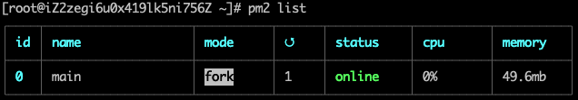

## 环境
 - CentOS 7.6 64位 
 - 阿里云学生机最低配置: 1核 1G 1M 

 
## 安装nodeJs和npm
通过SSH连接到服务器。进入要安装的目录，笔者这里用的`/usr/local/src`，你也可以在`/opt`下。
这里下载的二进制包，需要编译后使用，或还可以用CentOs的包管理工具`yum`安装。这里下载的node是`10.13.0`版本的，因为本地开发就是用这个版本，你也可以安装 [nrm](https://www.npmjs.com/package/nvm) 来管理node版本

```shell
cd /usr/local/src 
wget http://nodejs.org/dist/v10.13.0/node-v10.13.0.tar.gz
```
完成后得到node-v10.13.0.tar.gz ，解压缩并进入目录。

```shell
tar -xzvf node-v10.13.0.tar.gz
cd node-v10.13.0
```
编译前环境监测。

```shell
./configure
```  
如果没报错忽略这条。新服务器这里会报错，提示需要安装`g++`，它是c++的编译器，有人做了相关的编译包整合，比一个一个自己装方便，我们这里直接安装整合包，安装完成后重新执行`./configure`。

```shell
yum groupinstall "Development Tools"
...
./configure

```  
编译并安装。由于服务器配置不高，我大概等了五分钟左右。

```shell
make && make install
```  
创建node和npm软连接 `ln -s 源文件 目标文件`，执行目标文件就相当于执行源文件。完成后全局可以使用node和npm命令 

```shell
ln -s /usr/local/src/node-v10.13.0/bin/node /usr/local/bin/node
ln -s /usr/local/src/node-v10.13.0/bin/npm /usr/local/bin/npm
```  
检查软链接是否配置成功，得到版本为成功配置：

```shell
node -v 
10.13.0
npm -v
6.4.1
```
## 安装mysql
- 版本5.7  

由于`yum`的源中没`mysql`，需要去[mysql官网](https://dev.mysql.com/downloads/repo/yum/)找到源地址下载。

```shell
wget https://dev.mysql.com/get/mysql57-community-release-el7-9.noarch.rpm
```
安装源，完成后会在`/etc/yum.repos.d/`目录下增加两个文件`mysql-community.repo`和`mysql-community-source.repo`

```shell
rpm -ivh mysql57-community-release-el7-9.noarch.rpm
```
安装`mysql`:

```shell
yum install mysql-server
```
启动`msyql`：

```shell
systemctl start mysqld
```
获取临时mysql密码，并登陆

```shell
grep 'temporary password' /var/log/mysqld.log
...
mysql -u root -p
```  
登陆成功后先修改密码：  

```shell
> ALTER USER 'root'@'localhost' IDENTIFIED BY '你的新密码';
``` 
授权其他机器进行登陆本机`mysql`:

```shell
> ALTER GRANT ALL PRIVILEGES ON *.* TO 'root'@'%' IDENTIFIED BY '你的新密码' WITH GRANT OPTION;
  ...
> FLUSH  PRIVILEGES;
``` 
退出，至此，完成mysql安装。 

```shell
> exit;
```   

## 配置git拉取项目 

设置git账号信息:

```shell
git config --global user.name "你的用户名"
git config --global user.email "你的邮箱"
``` 
查看git账号信息:

```shell
git config user.name
git config user.email
``` 
生成公钥和密钥，它会在`~/.ssh/`生成三个文件，其中`known_hosts`为访问记录，`id_rsa`是私钥，`id_rsa_pub`是公钥。

```shell
ssh-keygen -t rsa -C "你的邮箱"
``` 
复制公钥内容，添加到[Github](https://github.com/settings/ssh/new)用于鉴权。   
位置：Github Profile > `setting` > `SSH and GPC keys` > `New SSH Key` > `Title为备注，把内容粘贴到Key表单中` > `Add SSH Key`   
   
```shell
cd ~/.ssh
vim id_rsa.pub
``` 


至此服务器有权限从github获取项目了，进入/opt克隆你的项目  
 
```shell
cd /opt
git clone 你的项目ssh地址
``` 
## 部署  
>常规启动项目在遇到服务器重启或其他意外会直接停止服务，这非常不方便。笔者这里推荐使用[pm2](https://pm2.keymetrics.io/)来完善操作，它是一个node守护进程管理器，可利用它简化node应用管理的繁琐任务，如性能监控、自动重启、负载均衡等，很通用而且使用非常简单。  

安装他:

```shell
npm install -g pm2
...
pm2 --version
4.4.1
```   
安装依赖，并使用`pm2`启动node项目：

```shell
cd node
npm install
...
pm2 start main.js --watch
``` 
查看`pm2`列表：  

```shell
pm2 list
```    
  
  
这是启动node项目下main.js示例。在本例中app_name默认为main，若要指定名称，在后面使用--name参数，更多参数请看下段。

```shell
pm2 start node/main.js
```  

更多参数:  

```shell
# 指定应用名称
--name <app_name>

# 当文件改变时，监听并重启应用(开启)
--watch

# 当文件改变时，监听并重启应用(停止)
--watch 0

# 设置应用程序重新加载的内存阈值
--max-memory-restart <200MB>

# 指定日志文件路径
--log <log_path>

# 重启延迟
--restart-delay <delay in ms>

```  
常用命令： 

 - `pm2 start <file_name>` 开启应用
 - `pm2 stop all  ` 	停止所有pm2应用
 - `pm2 stop <app_name> ` 	停止单个pm2应用
 - `pm2 list` 		查看所有应用状态
 - `pm2 restart <file_name>` 重启 
 - `pm2 descripe <app_name>` 查看单个应用状态
 

[更多pm2命令](https://pm2.keymetrics.io/docs/usage/quick-start/#options)  
  
至此，部署成功了。现在开放你的node端口供公网访问，进入购买服务器官网控制台，例如笔者服务器是阿里云的，进入阿里云控制台增加安全组，添加你的node端口，保存即可。enjoy it。


