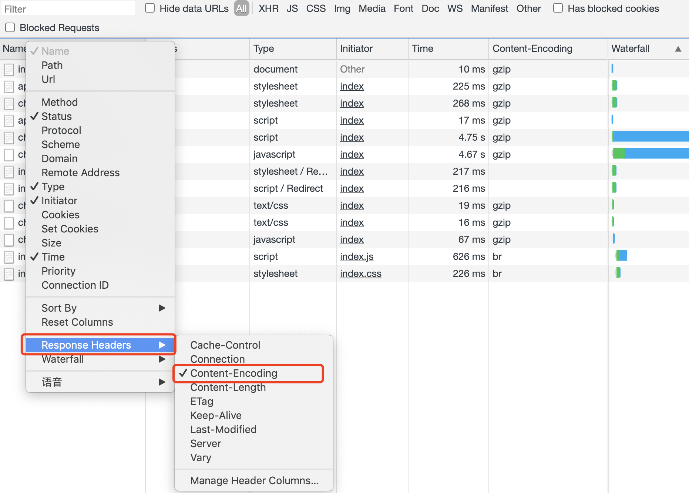
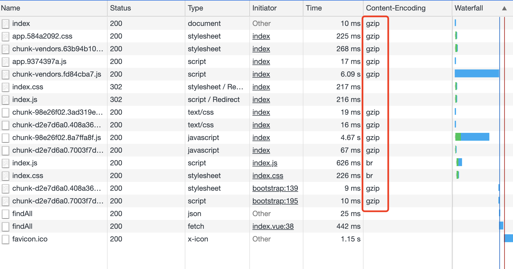

## 环境
 - nginx@1.19.2
 - vue-cli@4.5.0  
 
## vue实现gzip构建配置
安装依赖，它的作用是提供带`Content-Encoding`编码的压缩资源。

```shell
npm install compression-webpack-plugin --save-dev
```  

webpack配置，由于`vue-cli@2`以后隐藏`webpack.config.js`，也就是webpack的构建配置。它在内部编写了基础配置。  
[vue-cli 文档](https://cli.vuejs.org/zh/guide/)  

如果您想修改，你需要在vue根目录创建`vue.config.js`文件，像css一样，会自动覆盖隐藏的基础配置。gizp配置如下:  
[更多参数](https://www.webpackjs.com/plugins/compression-webpack-plugin/)

```javascript
// vue.config.js
const CompressionWebpackPlugin = require('compression-webpack-plugin'); 
const isProduction = process.env.NODE_ENV === 'production'; // 环境判断
const productionGzipExtensions = ['js', 'css']; // 需要gzip的文件类型

module.exports = {
  configureWebpack: config => {
    if (isProduction) { // 只有生产环境才压缩gzip
      config.plugins.push(new CompressionWebpackPlugin({
        // 压缩算法
        algorithm: 'gzip', 
        // 资源匹配
        test: new RegExp('\\.(' + productionGzipExtensions.join('|') + ')$'), 
        // 只有大于这个大小(byte)的资源才会被处理        
        threshold: 10240, 
        // 只有压缩率比这个值小的资源才会被处理
        minRatio: 0.8
      }))
    }
  }
}
```  
#### vue-cli 3.0以下配置
> 需要注意的是需要安装1.x.x版本，2+版本的配置项`asset`更换成了`filename`。  
> 
> 如果你要安装2+版本到`/build/webpack.prod.conf.js`中`new CompressionWebpackPlugin`的第一个参数从`asset`修改成`filename`。

```javascript
// 安装依赖
npm install compression-webpack-plugin@1.1.9 --save-dev

// 进入/config/index.js, productionGzip参数改成true
build: {
	...
	productionGzip: true
}

// 更多参数配置在/build/webpack.prod.conf.js
if (config.build.productionGzip) {
  const CompressionWebpackPlugin = require('compression-webpack-plugin')
  webpackConfig.plugins.push(
    new CompressionWebpackPlugin({
      ...
    })
  )
}
```  

## nginx配置
编辑nginx配置文件，我的在`/usr/local/nginx/conf/nginx.config`, 或使用`whereis nginx`查找, 得到地址找到 `conf/nginx.config`，打开配置文件，作用全局在`http块`中添加，作用单个服务在`server块`中添加。  

nginx.config: 

```shell
gzip  on; // on表示开启，off表示关闭；

# 需要压缩的MIME类型
gzip_types text/plain application/javascript application/x-javascript text/css application/xml text/javascript application/x-httpd-php image/jpeg image/gif image/png;
```  
[参考更多参数](https://segmentfault.com/a/1190000012694104)  

编辑保存后，重启nginx来更新配置:

```shell
cd /usr/local/nginx/sbin // 进入你的nginx下sbin目录

./nginx -s reload // 重启
```  

## 结果
重新构建vue并部署到nginx。
打开浏览器控制台，network面板，右键表头。  


勾选`Content-Encoding`  

    

看到 `gzip` 即成功。


